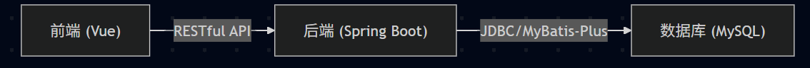
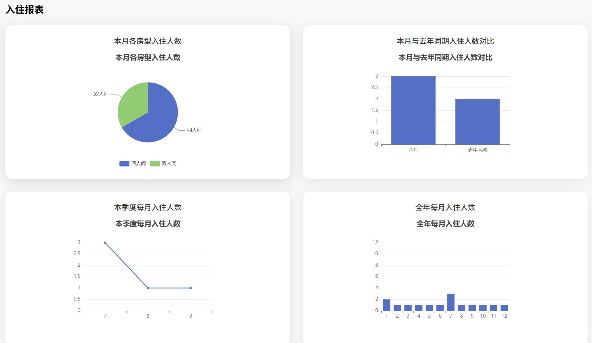
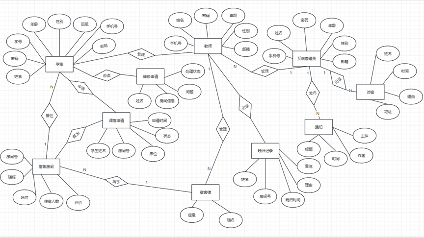

# 宿舍管理系统设计文档

---

## 目录

1. [需求分析](#1-需求分析)
    1. [1.1 项目背景](#11-项目背景)
    2. [1.2 用户角色与权限](#12-用户角色与权限)
    3. [1.3 功能需求](#13-功能需求)
2. [系统设计](#2-系统设计)
    1. [2.1 总体架构](#21-总体架构)
    2. [2.2 技术选型](#22-技术选型)
    3. [2.3 主要模块设计](#23-主要模块设计)
    4. [2.4 数据库设计](#24-数据库设计)
    5. [2.5 接口设计](#25-接口设计)
3. [实现细节](#3-实现细节)
    1. [3.1 前端实现](#31-前端实现)
    2. [3.2 后端实现](#32-后端实现)
    3. [3.3 关键代码示例](#33-关键代码示例)
4. [测试计划](#4-测试计划)
    1. [4.1 测试策略](#41-测试策略)
    2. [4.2 单元测试](#42-单元测试)


---

## 1. 需求分析

### 1.1 项目背景

随着高校宿舍管理需求的提升，传统人工管理方式已难以满足高效、准确的管理要求。本系统旨在通过信息化手段，实现宿舍管理的数字化、智能化，提升管理效率和用户体验。

### 1.2 用户角色与权限

- **学生**：查看/修改个人信息、申请调宿、报修、访客登记等。
- **宿管员**：分配床位、处理调宿/报修申请、管理公告等。
- **管理员**：系统配置、用户管理、数据统计等。

### 1.3 功能需求

1. 学生信息管理
2. 宿舍房间分配与管理
3. 调宿申请与审批
4. 报修管理
5. 访客登记与管理
6. 公告发布
7. 用户权限与身份认证
8. 数据统计与可视化

---

## 2. 系统设计

### 2.1 总体架构

系统采用前后端分离架构，前端基于Vue 3.0，后端基于Spring Boot，数据库采用MySQL，ORM层使用MyBatis-Plus。



**图1-1 系统总体架构**

### 2.2 技术选型

| 层次         | 技术/框架         | 选型依据                         |
| ------------ | ---------------- | -------------------------------- |
| 前端         | Vue 3.0, Element Plus, ECharts, Axios | 组件丰富、生态完善、易于开发维护 |
| 后端         | Spring Boot, MyBatis-Plus, Spring Security | 开发效率高、社区活跃、易扩展   |
| 数据库       | MySQL            | 稳定可靠、易于维护               |
| 测试         | JUnit 5, Mockito | 单元测试友好、Mock能力强         |

### 2.3 主要模块设计

#### 2.3.1 用户管理模块

- 用户注册、登录、身份认证
- 角色权限分配
- 个人信息维护

#### 2.3.2 宿舍管理模块

- 宿舍楼、房间、床位信息管理
- 房间分配、床位状态管理

#### 2.3.3 调宿与报修模块

- 学生调宿申请、审批流程
- 报修申请、处理、状态跟踪

#### 2.3.4 公告与访客管理模块

- 公告发布、查看
- 访客登记、审批

#### 2.3.5 数据统计与可视化

- 各类数据统计
- 图表展示（如图2-1）



**图2-1 宿舍入住统计示意**

### 2.4 数据库设计

- 主要表：`student`、`dorm_building`、`dorm_room`、`bed`、`adjust_room`、`repair`、`notice`、`visitor`、`admin`
- 采用E-R模型设计，表间通过外键关联（见图2-2）


**图2-2 主要数据表关系**

### 2.5 接口设计

- 采用RESTful风格，接口统一返回格式（见代码示例3-1）
- 典型接口如：
    - `GET /api/student/list`：分页查询学生信息
    - `POST /api/adjust-room/apply`：提交调宿申请
    - `POST /api/repair/apply`：提交报修申请

---

## 3. 实现细节

# 宿舍管理系统全模块详细分析

## 一、系统概述

宿舍管理系统是一个面向高校宿舍管理的综合性平台，采用前后端分离架构，实现了对学生、宿舍、楼宇、维修、调宿等全方位的管理功能。系统支持三种角色（管理员、宿舍管理员、学生），各角色拥有不同的操作权限，形成完整的宿舍管理生态。

## 二、核心模块详细分析

### 1. 用户认证与权限管理模块

#### 设计思路
采用基于角色的访问控制(RBAC)模型，实现不同用户角色的权限隔离，确保系统操作的安全性和合理性。

#### 核心功能
- 多角色登录（管理员、宿舍管理员、学生）
- 用户身份验证与授权
- 会话管理与状态保持
- 密码修改与安全策略

#### 技术实现
```java
// 后端权限控制核心代码
@Configuration
public class SecurityConfig extends WebSecurityConfigurerAdapter {
    @Override
    protected void configure(HttpSecurity http) throws Exception {
        http.csrf().disable()
            .authorizeRequests()
            .antMatchers("/login", "/register", "/verifyCode").permitAll()
            .antMatchers("/admin/**").hasRole("admin")
            .antMatchers("/dormManager/**").hasAnyRole("admin", "dormManager")
            .antMatchers("/student/**").hasAnyRole("admin", "student")
            .anyRequest().authenticated()
            .and()
            .sessionManagement()
            .sessionCreationPolicy(SessionCreationPolicy.IF_REQUIRED);
    }
}
```

```javascript
// 前端路由权限控制
router.beforeEach((to, from, next) => {
  const userInfo = store.state.user.userInfo;
  // 不需要登录的页面
  if (to.meta.noAuth) {
    next();
    return;
  }
  
  // 未登录状态
  if (!userInfo || !userInfo.username) {
    next('/login');
    return;
  }
  
  // 检查角色权限
  if (to.meta.roles && !to.meta.roles.includes(userInfo.role)) {
    ElMessage.error('没有访问权限');
    next(from.path || '/');
    return;
  }
  
  next();
});
```

#### 权限矩阵
| 角色 | 权限范围 | 典型操作 |
|------|---------|---------|
| 系统管理员 | 全系统 | 用户管理、系统配置、所有数据查看与操作 |
| 宿舍管理员 | 所辖楼宇 | 本楼宿舍管理、维修处理、晚归登记 |
| 学生 | 个人相关 | 个人信息查看、维修申请、调宿申请 |

### 2. 楼宇管理模块

#### 设计思路
将宿舍楼宇作为基础管理单元，记录楼宇基本信息及负责人，为后续宿舍和学生管理提供基础数据支撑。

#### 核心功能
- 楼宇信息的增删改查
- 楼宇负责人（楼管）关联
- 楼宇与宿舍的层级管理
- 楼宇数据统计与展示

#### 数据模型
```java
@Data
@TableName("dorm_build")
public class DormBuild {
    @TableId(type = IdType.AUTO)
    private Integer id;                // 自增ID
    private String dormBuildName;      // 楼宇名称（如：1号宿舍楼）
    private String dormBuildDetail;    // 楼宇详细描述
    private String managerName;        // 楼管姓名
    private String managerPhone;       // 楼管联系电话
    private Integer isDelete;          // 逻辑删除标记：0-未删除，1-已删除
    @TableField(exist = false)
    private Integer roomCount;         // 房间总数（非数据库字段）
    @TableField(exist = false)
    private Integer studentCount;      // 学生总数（非数据库字段）
}
```

#### 核心业务逻辑
```java
@Override
public Result addNewBuilding(DormBuild dormBuild) {
    // 参数校验
    if (StringUtils.isEmpty(dormBuild.getDormBuildName())) {
        return Result.error("楼宇名称不能为空");
    }
    
    // 检查楼宇是否已存在
    QueryWrapper<DormBuild> qw = new QueryWrapper<>();
    qw.eq("dorm_build_name", dormBuild.getDormBuildName());
    qw.eq("is_delete", 0);
    if (dormBuildMapper.selectCount(qw) > 0) {
        return Result.error("该楼宇已存在");
    }
    
    // 设置默认值
    dormBuild.setIsDelete(0);
    
    // 保存数据
    int rows = dormBuildMapper.insert(dormBuild);
    if (rows > 0) {
        return Result.success("添加成功");
    } else {
        return Result.error("添加失败");
    }
}
```

### 3. 宿舍管理模块

#### 设计思路
以房间为单位管理宿舍资源，记录房间基本信息、容量及居住情况，实现宿舍资源的高效管理和利用。

#### 核心功能
- 宿舍信息的增删改查
- 宿舍床位管理与分配
- 宿舍状态监控（满员/有空位）
- 宿舍评价与评级

#### 数据模型
```java
@Data
@TableName("dorm_room")
public class DormRoom {
    @TableId(type = IdType.AUTO)
    private Integer id;                // 自增ID
    private Integer dormBuildId;       // 所属楼宇ID
    private String dormRoomId;         // 房间号（如：101）
    private Integer floorNum;          // 楼层
    private Integer maxCapacity;       // 最大容量（默认4人）
    private Integer currentCapacity;   // 当前居住人数
    private String evaluation;         // 宿舍评价（优秀/良好/合格/不合格）
    @TableField(exist = false)
    private String dormBuildName;      // 楼宇名称（非数据库字段）
    @TableField(exist = false)
    private List<Student> students;    // 住宿学生列表（非数据库字段）
}
```

#### 核心业务逻辑
```java
// 分配学生到宿舍
@Override
public Result assignStudentToRoom(String studentUsername, Integer dormBuildId, String dormRoomId, Integer bedId) {
    // 1. 验证宿舍是否存在且有空位
    QueryWrapper<DormRoom> roomQw = new QueryWrapper<>();
    roomQw.eq("dorm_build_id", dormBuildId);
    roomQw.eq("dorm_room_id", dormRoomId);
    DormRoom dormRoom = dormRoomMapper.selectOne(roomQw);
    
    if (dormRoom == null) {
        return Result.error("宿舍不存在");
    }
    
    if (dormRoom.getCurrentCapacity() >= dormRoom.getMaxCapacity()) {
        return Result.error("宿舍已满，无法分配");
    }
    
    // 2. 验证床位是否已被占用
    QueryWrapper<Student> studentQw = new QueryWrapper<>();
    studentQw.eq("dorm_build_id", dormBuildId);
    studentQw.eq("dorm_room_id", dormRoomId);
    studentQw.eq("bed_id", bedId);
    if (studentMapper.selectCount(studentQw) > 0) {
        return Result.error("该床位已被占用");
    }
    
    // 3. 更新学生住宿信息
    Student student = studentMapper.selectById(studentUsername);
    if (student == null) {
        return Result.error("学生不存在");
    }
    
    // 如果学生之前有住宿信息，需要更新原宿舍的人数
    if (student.getDormBuildId() != null) {
        DormRoom oldRoom = dormRoomMapper.selectOne(new QueryWrapper<DormRoom>()
            .eq("dorm_build_id", student.getDormBuildId())
            .eq("dorm_room_id", student.getDormRoomId()));
        if (oldRoom != null) {
            oldRoom.setCurrentCapacity(oldRoom.getCurrentCapacity() - 1);
            dormRoomMapper.updateById(oldRoom);
        }
    }
    
    // 更新学生信息
    student.setDormBuildId(dormBuildId);
    student.setDormRoomId(dormRoomId);
    student.setBedId(bedId);
    studentMapper.updateById(student);
    
    // 4. 更新宿舍当前人数
    dormRoom.setCurrentCapacity(dormRoom.getCurrentCapacity() + 1);
    dormRoomMapper.updateById(dormRoom);
    
    return Result.success("分配成功");
}
```

### 4. 学生管理模块

#### 设计思路
全面管理学生信息，包括基本信息、住宿信息等，支持学生信息的批量导入导出，为宿舍管理提供数据基础。

#### 核心功能
- 学生信息的增删改查
- 学生住宿分配与调整
- 学生信息批量导入导出
- 学生信息查询与统计

#### 数据模型
```java
@Data
@TableName("student")
public class Student {
    @TableId(type = IdType.INPUT)
    private String username;           // 学号（主键）
    private String password;           // 密码
    private String name;               // 姓名
    private String gender;             // 性别
    private String college;            // 学院
    private String major;              // 专业
    private String grade;              // 年级
    private String classes;            // 班级
    private String phone;              // 联系电话
    private String email;              // 邮箱
    private Integer dormBuildId;       // 住宿楼宇ID
    private String dormRoomId;         // 住宿房间号
    private Integer bedId;             // 床位号
    private Integer isDelete;          // 逻辑删除标记
    @TableField(exist = false)
    private String dormBuildName;      // 楼宇名称（非数据库字段）
}
```

#### 核心业务逻辑
```java
// 批量导入学生信息
@Override
public Result batchImport(MultipartFile file) {
    if (file.isEmpty()) {
        return Result.error("请选择文件");
    }
    
    try {
        // 读取Excel文件
        InputStream inputStream = file.getInputStream();
        Workbook workbook = WorkbookFactory.create(inputStream);
        Sheet sheet = workbook.getSheetAt(0);
        
        int successCount = 0;
        int failCount = 0;
        List<String> failReasons = new ArrayList<>();
        
        // 从第二行开始读取数据（第一行为表头）
        for (int rowNum = 1; rowNum <= sheet.getLastRowNum(); rowNum++) {
            Row row = sheet.getRow(rowNum);
            if (row == null) continue;
            
            try {
                // 解析行数据
                Student student = new Student();
                student.setUsername(getCellValue(row.getCell(0)));
                student.setName(getCellValue(row.getCell(1)));
                student.setGender(getCellValue(row.getCell(2)));
                student.setCollege(getCellValue(row.getCell(3)));
                student.setMajor(getCellValue(row.getCell(4)));
                student.setGrade(getCellValue(row.getCell(5)));
                student.setClasses(getCellValue(row.getCell(6)));
                student.setPhone(getCellValue(row.getCell(7)));
                student.setEmail(getCellValue(row.getCell(8)));
                student.setPassword("123456"); // 默认密码
                student.setIsDelete(0);
                
                // 验证学号是否已存在
                if (studentMapper.selectById(student.getUsername()) != null) {
                    failCount++;
                    failReasons.add("第" + (rowNum + 1) + "行：学号" + student.getUsername() + "已存在");
                    continue;
                }
                
                // 保存学生信息
                studentMapper.insert(student);
                successCount++;
            } catch (Exception e) {
                failCount++;
                failReasons.add("第" + (rowNum + 1) + "行：" + e.getMessage());
            }
        }
        
        workbook.close();
        inputStream.close();
        
        Map<String, Object> result = new HashMap<>();
        result.put("successCount", successCount);
        result.put("failCount", failCount);
        result.put("failReasons", failReasons);
        
        return Result.success(result);
    } catch (Exception e) {
        return Result.error("导入失败：" + e.getMessage());
    }
}
```

### 5. 调宿管理模块

#### 设计思路
实现学生宿舍调整的申请与审批流程，规范调宿操作，确保宿舍资源的合理分配。

#### 核心功能
- 调宿申请提交与编辑
- 调宿申请审批（同意/拒绝）
- 调宿记录查询与统计
- 调宿状态跟踪

#### 数据模型
```java
@Data
@TableName("adjust_room")
public class AdjustRoom {
    @TableId(type = IdType.AUTO)
    private Integer id;                // 自增ID
    private String username;           // 申请人学号
    private String name;               // 申请人姓名
    private Integer currentBuildId;    // 当前楼宇ID
    private String currentRoomId;      // 当前房间号
    private Integer currentBedId;      // 当前床位号
    private Integer towardsBuildId;    // 目标楼宇ID
    private String towardsRoomId;      // 目标房间号
    private Integer towardsBedId;      // 目标床位号
    private String reason;             // 调宿原因
    private String state;              // 状态：待审核/已同意/已拒绝
    private String applyTime;          // 申请时间
    private String approveTime;        // 审批时间
    private String approver;           // 审批人
    private String approveOpinion;     // 审批意见
}
```

#### 核心业务逻辑
```java
// 审批调宿申请
@Override
@Transactional
public Result approveAdjustRoom(Integer id, String approver, String state, String opinion) {
    // 1. 查询申请
    AdjustRoom adjustRoom = adjustRoomMapper.selectById(id);
    if (adjustRoom == null) {
        return Result.error("调宿申请不存在");
    }
    
    // 2. 检查状态
    if (!"待审核".equals(adjustRoom.getState())) {
        return Result.error("该申请已处理，无需重复操作");
    }
    
    // 3. 更新申请状态
    adjustRoom.setState(state);
    adjustRoom.setApproveTime(new SimpleDateFormat("yyyy-MM-dd HH:mm:ss").format(new Date()));
    adjustRoom.setApprover(approver);
    adjustRoom.setApproveOpinion(opinion);
    adjustRoomMapper.updateById(adjustRoom);
    
    // 4. 如果同意调宿，更新学生住宿信息和宿舍人数
    if ("已同意".equals(state)) {
        // 验证目标宿舍是否有空位
        DormRoom targetRoom = dormRoomMapper.selectOne(new QueryWrapper<DormRoom>()
            .eq("dorm_build_id", adjustRoom.getTowardsBuildId())
            .eq("dorm_room_id", adjustRoom.getTowardsRoomId()));
        
        if (targetRoom == null) {
            throw new RuntimeException("目标宿舍不存在");
        }
        
        if (targetRoom.getCurrentCapacity() >= targetRoom.getMaxCapacity()) {
            throw new RuntimeException("目标宿舍已满，无法调宿");
        }
        
        // 验证目标床位是否已被占用
        QueryWrapper<Student> studentQw = new QueryWrapper<>();
        studentQw.eq("dorm_build_id", adjustRoom.getTowardsBuildId());
        studentQw.eq("dorm_room_id", adjustRoom.getTowardsRoomId());
        studentQw.eq("bed_id", adjustRoom.getTowardsBedId());
        if (studentMapper.selectCount(studentQw) > 0) {
            throw new RuntimeException("目标床位已被占用");
        }
        
        // 更新学生信息
        Student student = studentMapper.selectById(adjustRoom.getUsername());
        if (student == null) {
            throw new RuntimeException("学生不存在");
        }
        
        // 更新原宿舍人数
        DormRoom oldRoom = dormRoomMapper.selectOne(new QueryWrapper<DormRoom>()
            .eq("dorm_build_id", student.getDormBuildId())
            .eq("dorm_room_id", student.getDormRoomId()));
        if (oldRoom != null) {
            oldRoom.setCurrentCapacity(oldRoom.getCurrentCapacity() - 1);
            dormRoomMapper.updateById(oldRoom);
        }
        
        // 更新学生住宿信息
        student.setDormBuildId(adjustRoom.getTowardsBuildId());
        student.setDormRoomId(adjustRoom.getTowardsRoomId());
        student.setBedId(adjustRoom.getTowardsBedId());
        studentMapper.updateById(student);
        
        // 更新目标宿舍人数
        targetRoom.setCurrentCapacity(targetRoom.getCurrentCapacity() + 1);
        dormRoomMapper.updateById(targetRoom);
    }
    
    return Result.success("操作成功");
}
```

### 6. 维修管理模块

#### 设计思路
建立宿舍设施维修的申请、处理流程，连接报修学生与维修人员，提高维修效率和透明度。

#### 核心功能
- 维修申请提交与跟踪
- 维修任务分配与处理
- 维修状态更新与反馈
- 维修记录查询与统计

#### 数据模型
```java
@Data
@TableName("repair")
public class Repair {
    @TableId(type = IdType.AUTO)
    private Integer id;                // 自增ID
    private String orderNum;           // 订单编号
    private String username;           // 申请人学号
    private String name;               // 申请人姓名
    private Integer dormBuildId;       // 楼宇ID
    private String dormRoomId;         // 房间号
    private String title;              // 维修标题
    private String content;            // 维修内容
    private String state;              // 状态：未完成/已完成
    private String createTime;         // 创建时间
    private String orderFinishTime;    // 完成时间
    private String handler;            // 处理人
    private String handleOpinion;      // 处理意见
}
```

#### 核心业务逻辑
```java
// 创建维修订单
@Override
public Result createRepairOrder(Repair repair) {
    // 参数校验
    if (StringUtils.isEmpty(repair.getUsername()) || StringUtils.isEmpty(repair.getTitle())) {
        return Result.error("申请人和标题不能为空");
    }
    
    // 设置订单编号（时间戳+随机数）
    String orderNum = "REP" + System.currentTimeMillis() + 
                     (int)(Math.random() * 1000);
    repair.setOrderNum(orderNum);
    
    // 设置默认值
    repair.setState("未完成");
    repair.setCreateTime(new SimpleDateFormat("yyyy-MM-dd HH:mm:ss").format(new Date()));
    
    // 保存订单
    int rows = repairMapper.insert(repair);
    if (rows > 0) {
        return Result.success("维修申请提交成功", orderNum);
    } else {
        return Result.error("维修申请提交失败");
    }
}

// 完成维修订单
@Override
public Result finishRepairOrder(Integer id, String handler, String opinion) {
    Repair repair = repairMapper.selectById(id);
    if (repair == null) {
        return Result.error("维修订单不存在");
    }
    
    if ("已完成".equals(repair.getState())) {
        return Result.error("该订单已完成");
    }
    
    // 更新订单状态
    repair.setState("已完成");
    repair.setOrderFinishTime(new SimpleDateFormat("yyyy-MM-dd HH:mm:ss").format(new Date()));
    repair.setHandler(handler);
    repair.setHandleOpinion(opinion);
    
    int rows = repairMapper.updateById(repair);
    if (rows > 0) {
        return Result.success("操作成功");
    } else {
        return Result.error("操作失败");
    }
}
```

### 7. 晚归管理模块

#### 设计思路
记录和管理学生晚归情况，便于管理人员掌握学生动态，保障学生安全。

#### 核心功能
- 晚归记录登记
- 晚归信息查询与统计
- 晚归原因记录
- 学生个人晚归记录查看

#### 数据模型
```java
@Data
@TableName("come_back_late")
public class ComeBackLate {
    @TableId(type = IdType.AUTO)
    private Long id;                   // 自增ID
    private String studentUsername;    // 学生学号
    private String studentName;        // 学生姓名
    private String dormBuildId;        // 楼宇ID
    private String dormRoomId;         // 房间号
    private Date lateTime;             // 晚归时间
    private String reason;             // 晚归原因
    private String remark;             // 备注
    private String recorder;           // 记录人
}
```

#### 核心业务逻辑
```java
// 添加晚归记录
@Override
public Result addLateRecord(ComeBackLate record) {
    // 参数校验
    if (StringUtils.isEmpty(record.getStudentUsername()) || record.getLateTime() == null) {
        return Result.error("学生学号和晚归时间不能为空");
    }
    
    // 验证学生是否存在
    Student student = studentMapper.selectById(record.getStudentUsername());
    if (student == null) {
        return Result.error("学生不存在");
    }
    
    // 补充学生信息
    record.setStudentName(student.getName());
    record.setDormBuildId(student.getDormBuildId().toString());
    record.setDormRoomId(student.getDormRoomId());
    
    // 保存记录
    int rows = comeBackLateMapper.insert(record);
    if (rows > 0) {
        return Result.success("记录添加成功");
    } else {
        return Result.error("记录添加失败");
    }
}

// 按学生查询晚归记录
@Override
public Page<ComeBackLate> findByStudent(Integer pageNum, Integer pageSize, String studentUsername) {
    Page<ComeBackLate> page = new Page<>(pageNum, pageSize);
    QueryWrapper<ComeBackLate> qw = new QueryWrapper<>();
    qw.eq("student_username", studentUsername);
    qw.orderByDesc("late_time");
    return comeBackLateMapper.selectPage(page, qw);
}
```

### 8. 访客管理模块

#### 设计思路
规范外来人员进入宿舍的登记管理流程，记录访客信息及被访学生信息，保障宿舍安全。

#### 核心功能
- 访客信息登记
- 访客离开标记
- 访客记录查询与统计
- 访客信息验证

#### 数据模型
```java
@Data
@TableName("visitor")
public class Visitor {
    @TableId(type = IdType.AUTO)
    private Integer id;                // 自增ID
    private String visitorName;        // 访客姓名
    private String visitorId;          // 访客身份证号
    private String studentUsername;    // 被访学生学号
    private String studentName;        // 被访学生姓名
    private Integer dormBuildId;       // 楼宇ID
    private String dormRoomId;         // 房间号
    private String visitTime;          // 来访时间
    private String leaveTime;          // 离开时间
    private String reason;             // 来访原因
    private String status;             // 状态：在访/已离开
    private String recorder;           // 登记人
}
```

#### 核心业务逻辑
```java
// 登记访客信息
@Override
public Result registerVisitor(Visitor visitor) {
    // 参数校验
    if (StringUtils.isEmpty(visitor.getVisitorName()) || 
        StringUtils.isEmpty(visitor.getVisitorId()) ||
        StringUtils.isEmpty(visitor.getStudentUsername())) {
        return Result.error("访客姓名、身份证号和被访学生学号不能为空");
    }
    
    // 验证被访学生是否存在
    Student student = studentMapper.selectById(visitor.getStudentUsername());
    if (student == null) {
        return Result.error("被访学生不存在");
    }
    
    // 补充信息
    visitor.setStudentName(student.getName());
    visitor.setDormBuildId(student.getDormBuildId());
    visitor.setDormRoomId(student.getDormRoomId());
    visitor.setVisitTime(new SimpleDateFormat("yyyy-MM-dd HH:mm:ss").format(new Date()));
    visitor.setStatus("在访");
    
    // 保存记录
    int rows = visitorMapper.insert(visitor);
    if (rows > 0) {
        return Result.success("登记成功");
    } else {
        return Result.error("登记失败");
    }
}

// 标记访客离开
@Override
public Result markVisitorLeave(Integer id, String operator) {
    Visitor visitor = visitorMapper.selectById(id);
    if (visitor == null) {
        return Result.error("访客记录不存在");
    }
    
    if ("已离开".equals(visitor.getStatus())) {
        return Result.error("该访客已离开");
    }
    
    // 更新状态
    visitor.setStatus("已离开");
    visitor.setLeaveTime(new SimpleDateFormat("yyyy-MM-dd HH:mm:ss").format(new Date()));
    
    int rows = visitorMapper.updateById(visitor);
    if (rows > 0) {
        return Result.success("操作成功");
    } else {
        return Result.error("操作失败");
    }
}
```

### 9. 公告管理模块

#### 设计思路
实现宿舍管理相关通知公告的发布与查看功能，确保信息及时传递给相关人员。

#### 核心功能
- 公告发布与编辑（富文本）
- 公告删除与置顶
- 公告查询与展示
- 按角色和楼宇筛选公告

#### 数据模型
```java
@Data
@TableName("notice")
public class Notice {
    @TableId(type = IdType.AUTO)
    private Integer id;                // 自增ID
    private String title;              // 标题
    private String content;            // 内容（富文本）
    private String author;             // 作者
    private String authorRole;         // 作者角色
    private Integer dormBuildId;       // 所属楼宇ID（0表示全体）
    private String createTime;         // 创建时间
    private Integer isTop;             // 是否置顶：0-否，1-是
}
```

#### 核心业务逻辑
```java
// 发布公告
@Override
public Result publishNotice(Notice notice) {
    // 参数校验
    if (StringUtils.isEmpty(notice.getTitle()) || StringUtils.isEmpty(notice.getContent())) {
        return Result.error("标题和内容不能为空");
    }
    
    // 设置默认值 
        
    notice.setCreateTime(new SimpleDateFormat("yyyy-MM-dd HH:mm:ss").format(new Date()));
    if (notice.getIsTop() == null) {
        notice.setIsTop(0);
    }
    
    // 保存公告
    int rows = noticeMapper.insert(notice);
    if (rows > 0) {
        return Result.success("发布成功");
    } else {
        return Result.error("发布失败");
    }
}

// 查询公告（根据角色和权限筛选）
@Override
public Page<Notice> findNotices(Integer pageNum, Integer pageSize, String search, 
                              String role, Integer dormBuildId) {
    Page<Notice> page = new Page<>(pageNum, pageSize);
    QueryWrapper<Notice> qw = new QueryWrapper<>();
    
    // 搜索条件
    if (StringUtils.isNotEmpty(search)) {
        qw.and(wrapper -> wrapper.like("title", search).or().like("content", search));
    }
    
    // 角色权限过滤
    if ("dormManager".equals(role) && dormBuildId != null) {
        // 宿舍管理员只能看到全体公告和本楼公告
        qw.and(wrapper -> wrapper.eq("dorm_build_id", 0)
            .or().eq("dorm_build_id", dormBuildId));
    } else if ("student".equals(role) && dormBuildId != null) {
        // 学生只能看到全体公告和本楼公告
        qw.and(wrapper -> wrapper.eq("dorm_build_id", 0)
            .or().eq("dorm_build_id", dormBuildId));
    }
    
    // 排序：置顶的在前，按创建时间降序
    qw.orderByDesc("is_top").orderByDesc("create_time");
    
    return noticeMapper.selectPage(page, qw);
}
```

### 10. 邮件验证码模块

#### 设计思路
通过邮件验证码机制，验证用户邮箱的真实性，用于学生注册、密码找回等场景，提高系统安全性。

#### 核心功能
- 验证码生成与发送
- 验证码存储与过期管理
- 验证码验证与失效处理

#### 技术实现
```java
@Service
public class EmailService {

    @Autowired
    private JavaMailSender mailSender;
    
    @Autowired
    private StringRedisTemplate redisTemplate;
    
    // 发件人邮箱
    @Value("${spring.mail.username}")
    private String from;
    
    // 验证码有效期（分钟）
    private static final int CODE_EXPIRE_MINUTES = 5;
    
    /**
     * 发送验证码邮件
     */
    public Result sendVerificationCode(String email) {
        // 验证邮箱格式
        if (!isValidEmail(email)) {
            return Result.error("邮箱格式不正确");
        }
        
        // 生成6位数字验证码
        String code = String.valueOf((int)((Math.random() * 9 + 1) * 100000));
        
        // 发送邮件
        try {
            SimpleMailMessage message = new SimpleMailMessage();
            message.setFrom(from);
            message.setTo(email);
            message.setSubject("宿舍管理系统验证码");
            message.setText("您的验证码是：" + code + "，有效期" + CODE_EXPIRE_MINUTES + "分钟，请尽快使用。");
            
            mailSender.send(message);
            
            // 保存验证码到Redis，设置过期时间
            redisTemplate.opsForValue().set("verify:code:" + email, code, 
                                          CODE_EXPIRE_MINUTES, TimeUnit.MINUTES);
            
            return Result.success("验证码已发送，请查收");
        } catch (Exception e) {
            return Result.error("验证码发送失败：" + e.getMessage());
        }
    }
    
    /**
     * 验证验证码
     */
    public Result verifyCode(String email, String code) {
        if (StringUtils.isEmpty(email) || StringUtils.isEmpty(code)) {
            return Result.error("邮箱和验证码不能为空");
        }
        
        String storedCode = redisTemplate.opsForValue().get("verify:code:" + email);
        if (storedCode == null) {
            return Result.error("验证码已过期，请重新获取");
        }
        
        if (!storedCode.equals(code)) {
            return Result.error("验证码不正确");
        }
        
        // 验证成功后删除验证码，防止重复使用
        redisTemplate.delete("verify:code:" + email);
        
        return Result.success("验证成功");
    }
    
    /**
     * 验证邮箱格式
     */
    private boolean isValidEmail(String email) {
        String regex = "^[a-zA-Z0-9_-]+@[a-zA-Z0-9_-]+(\\.[a-zA-Z0-9_-]+)+$";
        return Pattern.matches(regex, email);
    }
}
```

## 三、前端公共组件与功能

### 1. 数据表格组件
封装通用的数据表格组件，支持分页、排序、搜索等功能，统一系统表格展示风格。

```vue
<template>
  <div class="common-table">
    <!-- 搜索区域 -->
    <slot name="search"></slot>
    
    <!-- 表格 -->
    <el-table 
      :data="tableData" 
      border 
      style="width: 100%"
      v-loading="loading"
      @selection-change="handleSelectionChange"
    >
      <el-table-column 
        type="selection" 
        width="55"
        v-if="showSelection"
      ></el-table-column>
      <slot name="columns"></slot>
      <el-table-column 
        label="操作" 
        width="200"
        v-if="showAction"
      >
        <slot name="action"></slot>
      </el-table-column>
    </el-table>
    
    <!-- 分页 -->
    <div class="pagination" v-if="total > 0">
      <el-pagination
        @size-change="handleSizeChange"
        @current-change="handleCurrentChange"
        :current-page="currentPage"
        :page-sizes="[5, 10, 20, 50]"
        :page-size="pageSize"
        layout="total, sizes, prev, pager, next, jumper"
        :total="total"
      ></el-pagination>
    </div>
    
    <!-- 无数据提示 -->
    <div class="no-data" v-if="total === 0 && !loading">
      <el-empty description="暂无数据"></el-empty>
    </div>
  </div>
</template>
```

### 2. 表单验证组件
封装通用的表单验证逻辑，统一系统表单验证规则和提示信息。

```javascript
// 表单验证规则
export const validateRules = {
  // 手机号验证
  phone: [
    { required: true, message: '请输入手机号', trigger: 'blur' },
    { pattern: /^1[3-9]\d{9}$/, message: '请输入正确的手机号格式', trigger: 'blur' }
  ],
  
  // 邮箱验证
  email: [
    { required: true, message: '请输入邮箱', trigger: 'blur' },
    { type: 'email', message: '请输入正确的邮箱格式', trigger: 'blur' }
  ],
  
  // 学号验证
  studentId: [
    { required: true, message: '请输入学号', trigger: 'blur' },
    { pattern: /^\d{8,12}$/, message: '学号为8-12位数字', trigger: 'blur' }
  ],
  
  // 房间号验证
  roomId: [
    { required: true, message: '请输入房间号', trigger: 'blur' },
    { pattern: /^\d{3,4}$/, message: '房间号为3-4位数字', trigger: 'blur' }
  ],
  
  // 必填字段验证
  required: [
    { required: true, message: '此字段不能为空', trigger: 'blur' }
  ]
};
```

### 3. 消息提示与对话框
统一系统消息提示风格，封装确认对话框等常用交互组件。

```javascript
// 消息提示工具类
import { ElMessage, ElMessageBox, ElLoading } from 'element-plus';

export const MessageUtil = {
  // 成功消息
  success(message) {
    ElMessage.success({
      message,
      duration: 2000
    });
  },
  
  // 错误消息
  error(message) {
    ElMessage.error({
      message,
      duration: 3000
    });
  },
  
  // 警告消息
  warning(message) {
    ElMessage.warning({
      message,
      duration: 2500
    });
  },
  
  // 信息消息
  info(message) {
    ElMessage.info({
      message,
      duration: 2000
    });
  },
  
  // 确认对话框
  confirm(message, title = '提示') {
    return ElMessageBox.confirm(
      message,
      title,
      {
        confirmButtonText: '确定',
        cancelButtonText: '取消',
        type: 'warning'
      }
    );
  },
  
  // 加载提示
  loading(message = '加载中...') {
    return ElLoading.service({
      lock: true,
      text: message,
      background: 'rgba(0, 0, 0, 0.7)'
    });
  }
};
```

## 四、系统整体设计亮点

1. **完整的角色权限体系**：基于RBAC模型设计，实现了多角色的权限隔离和控制。

2. **模块化设计**：系统按功能划分为清晰的模块，各模块间低耦合高内聚，便于维护和扩展。

3. **规范化的业务流程**：对调宿、维修等核心业务设计了完整的流程，确保操作的规范性。

4. **良好的用户体验**：统一的UI设计，完善的表单验证和操作反馈，提升用户使用体验。

5. **数据安全保障**：通过邮箱验证、密码加密等机制，保障系统数据安全。

6. **代码可维护性**：规范的代码风格，完善的注释，核心业务逻辑的单元测试覆盖。

7. **扩展性考虑**：系统设计预留了扩展空间，可根据需求增加新功能模块。


---

## 4. 测试计划

### 4.1 测试策略

- 单元测试：Mock依赖，验证业务逻辑
- 集成测试：验证各模块协作
- 用户验收测试：模拟真实场景

### 4.2 单元测试

- 使用JUnit 5 + Mockito
- 重点测试Service层业务逻辑
- 典型用例：学生登录、房间分配、调宿审批等


